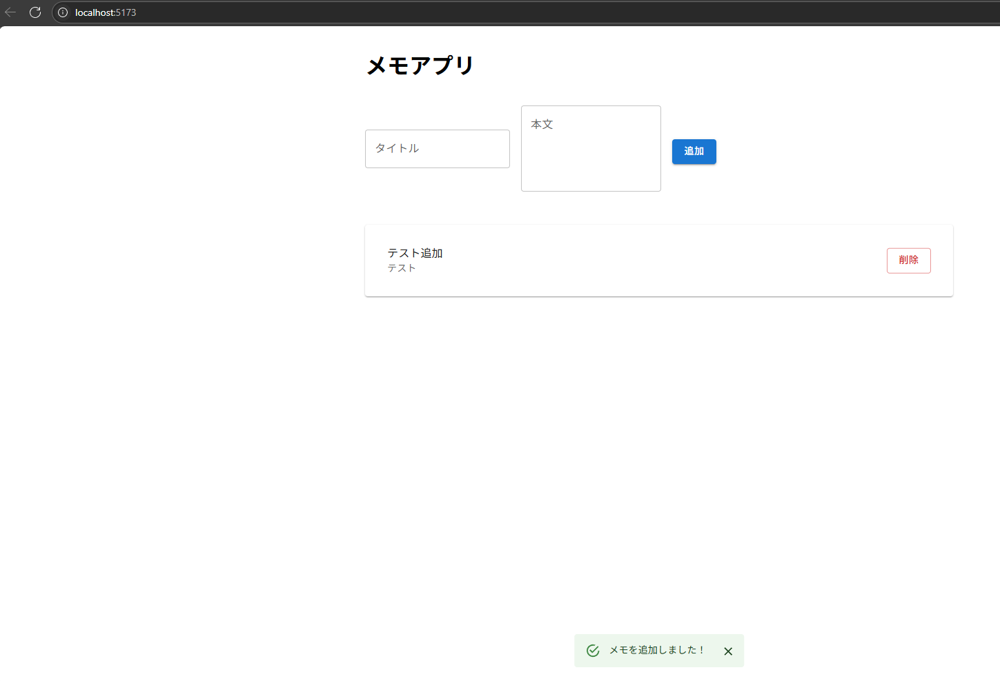

# SimpleNoteApp

React + MUI によるシンプルなメモアプリです。<br>
タイトルと本文を入力してメモを追加・削除できる、最低限のCRUD機能を備えた画面です。



---

## 特徴

-  タイトルと本文のメモ追加（タイトル必須）
-  メモ一覧の表示
-  削除ボタンと削除確認ダイアログ
-  スナックバー通知（成功/失敗）
-  Material UI を活用したシンプルで直感的なUI

---

## 使用技術

| 技術         | 説明 |
|--------------|------|
| React        | フロントエンドフレームワーク |
| TypeScript   | 型安全なJavaScript |
| MUI (Material UI) | UIライブラリ |
| Axios        | API通信ライブラリ |
| NestJS + Prisma + SQLite（バックエンド） | バックエンドAPI（メモ管理） |

---

## API仕様

| メソッド | パス           | 説明               |
|----------|----------------|--------------------|
| GET      | `/api/notes`   | メモ一覧を取得     |
| POST     | `/api/notes`   | メモを新規作成     |
| DELETE   | `/api/notes/:id` | 指定IDのメモを削除 |

---

## 💾 バックエンドDBテーブル定義（概要）

メモデータは以下のような構造です。

```prisma
model Note {
  id      Int     @id @default(autoincrement())
  title   String
  content String?
}
```

---

## 📁 ディレクトリ構成

```bash
simple-note-app/
├── public/
├── src/
│   ├── pages/
│   │   └── Notes.tsx         # メインページ（1ファイル構成）
│   ├── App.tsx
│   └── main.tsx
├── .gitignore
├── index.html
├── package.json
└── README.md

## セットアップ方法

1.リポジトリをクローン

```bash
git clone <リポジトリURL>
cd <リポジトリディレクトリ>
```

2.コンテナ起動 + frontend/backendコンテナにそれぞれ入る
```bash
docker compose up -d
docker exec -it frontend bash
docker exec -it backend bash
```


3.依存パッケージをインストール
```bash
npm install
```

4.開発サーバを起動

* frontend

  ```bash
  npm run dev
  ```

* backend
  ```bash
  npm run start:dev
  ```

5.ブラウザで http://localhost:3000 を開く

---